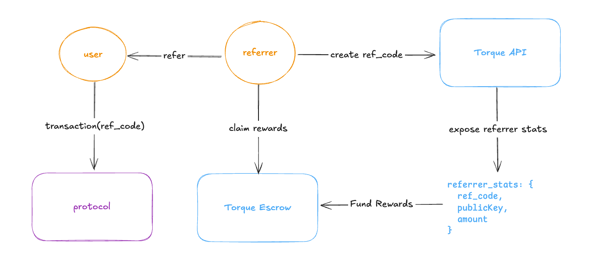

# Referral Rewards

<figure><figcaption></figcaption></figure>

Torque handles the association of referral code to public keys, attribution of value created by referrers, and distribution of rewards.

## Adding Referral Codes to Transactions

Once Torque is indexing your protocol, we are able to understand any piece of information in your transactions and use that information to build the incentives. In order to determine which transactions are attributed to a referrer, your protocol must take an optional argument called `ref_code`. In order to ensure accuracy and precision of the incentives, the `ref_code` must be present in the transaction. Once the ref\_code argument is present in transactions, Torque is able to track the value a referrer has created and translate it to rewards.

### Implementing the Protocol Upgrade

All that is required is adding an additional `ref_code` argument to whichever instructions will be used in determining referral fees. The following example shows how to do this for a given [Anchor Program](https://www.anchor-lang.com/docs/basics/program-structure).&#x20;

#### Existing Instruction

```
pub fn initialize(ctx: Context<Initialize>, data: u64) -> Result<()> {
    ctx.accounts.new_account.data = data;
    msg!("Changed data to: {}!", data);
    Ok(())
}
```

#### Torque Referral Instruction

<pre><code><strong>pub fn initialize(ctx: Context&#x3C;Initialize>, data: u64, ref_code: string) -> Result&#x3C;()> {
</strong>    ctx.accounts.new_account.data = data;
    msg!("Changed data to: {}!", data);
    Ok(())
}
</code></pre>

That's it! Now Torque is able to understand the user that referred the executor of the transaction.&#x20;

### Enabling Referral Codes in your Product

### Working with the Torque API

The following endpoint will return the user’s `ref_code` to be shared and passed to transactions. If the user does not have a `ref_code` it will generate one and return it, if the user already has one it will simply return it.

```
request: GET https://server.torque.so/user-ref-code?wallet=<user_pub_key>
response: {
    "status": "SUCCESS",
    "data": {
        "code": string,
        "publicKey": string,
        "vanity": string | null
    }
}
```

### Passing a Referral Code to Transactions

<figure><figcaption></figcaption></figure>

The UI implementation is up to the product's discretion, however a common pattern is to save ref codes in local storage. We have also found that it is helpful to display which ref code will be used in the transaction as well as the ability to update it.

### Fetching Referrer Data

The Torque Platform allows you to set up recurring queries that automatically generate API endpoints for accessing the latest results. For referral's specifically, you'll need to create a query to expose the `ref_code` and other relevant information. See [queries.md](../overview/core-concepts/queries.md "mention") for more details.&#x20;

#### Endpoint Structure

Parameters:

* {projectId} - Your project identifier
* {queryId} - The specific recurring query identifier

```
request: GET https://server.torque.so/project/{projectId}/query/recurring/{queryId}/latest-result
response: {
  "status": "SUCCESS",
  "data": {
    "lastUpdated": "2025-09-04T16:09:10.136Z",
    "data": [
      {
        "wallet": "walletAddress",
        "fieldName1": "value1",
        "fieldNameN": "valueN"
      }
    ]
  }
}

```

Response Fields:

* `status` - Indicates the query execution status
* `lastUpdated` - ISO timestamp of last data refresh
* `data` - Array containing the query results, where field names and values depend on your specific query definition
